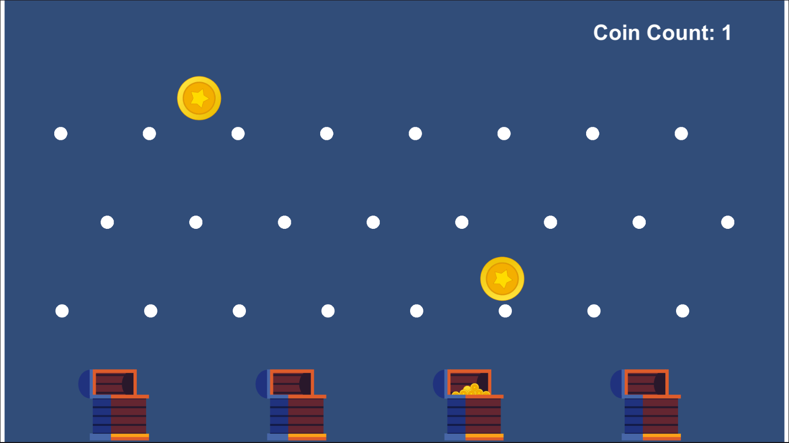

<h1 align="left">Sprite Pachinko</h1>  

### 💖 You can **play the game** here 👉   

---

✨ A simple Pachinko game, where:  
- The spawn manager spawns coins in random positions at a fixed rate,  
- UI handler counts the coins that reach chests,  
- The ones that fall beneath the ground return to the object pool,
- Chest sprites change when a coin lands.  

🌱 In this project:
- I studied and implemented Observer Design Pattern,
- Studied and implemented Object Pooling,
- Created sprites by using the Shapes2D extension asset from Unity Store.

